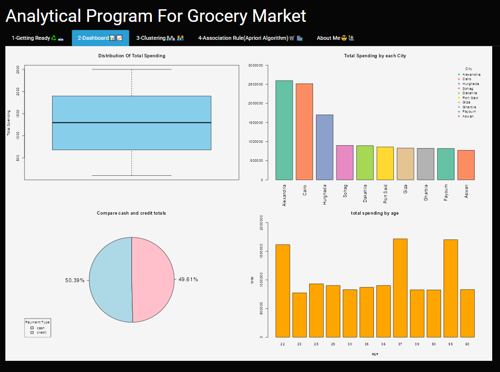
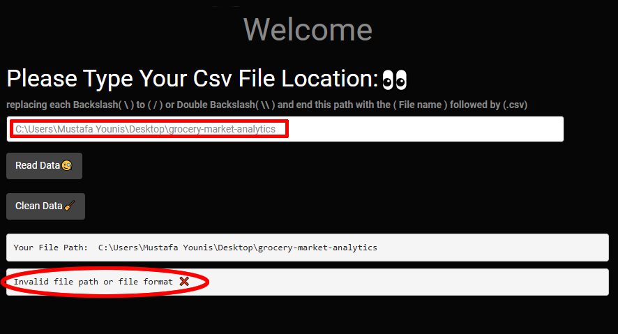
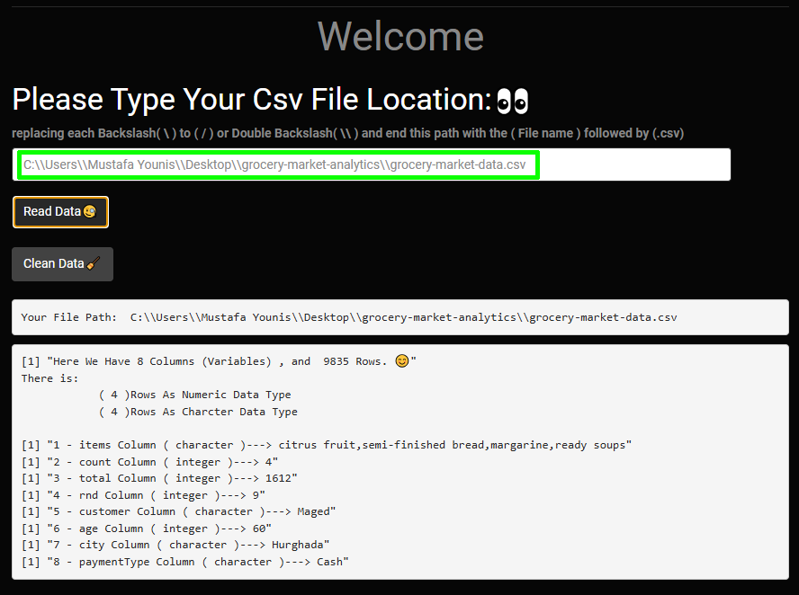

# Grocery Market Analytics App 🛒 
An interactive data analytics application built with **R** and **Shiny** to analyze grocery store transactions and extract actionable insights.

---

<p align="center">
  
</p>

---

## Documentation📄
This project includes two PDF files for better understanding:

- 📄 [grocery-market-overview.pdf](grocery-market-analytics-overview.pdf)  
  A quick overview that summarizes the project idea, features, and workflow.

- 📄 [grocery-market-analytics-report.pdf](grocery-market-analytics-report.pdf)  
  A detailed report that includes full explanations, inputs & outputs, data processing, visualizations, insights, and code breakdown.

---

## Project Structure📁 
```
📁 grocery-market-analytics  
 ┣ 📄 app.R                                   # Main application file (Shiny UI, server logic, and app execution)  
 ┣ 📄 grocery-market-data.csv                 # Project dataset  
 ┣ 📄 grocery-market-analytics-overview.pdf   # Quick overview of the project  
 ┣ 📄 grocery-market-analytics-report.pdf     # Full detailed report (inputs, outputs, insights, and code explanation)  
 ┣ 📄 README.md                               # Project documentation and usage guide  
 ┗ 📁 screenshots                             # Images used in README (examples and app previews)
     ┣ 📸 hero-image.png                      # Main preview image of the application (dashboard) 
     ┣ 📸 correct-path-example.png            # Example of correct dataset path format  
     ┣ 📸 wrong-path-example.png              # Example of incorrect dataset path format 

```

## ▶️ How to Run the app
Follow these steps to run the application:
### 1️⃣ Install R & RStudio
Make sure you have:
- R installed  
- RStudio installed  

---

### 2️⃣ Install Required Libraries
Open RStudio and run the following command in RStudio:

```r
install.packages(c(
  "shiny",
  "shinythemes",
  "reader",
  "magrittr",
  "dplyr",
  "RColorBrewer",
  "plotly",
  "arules"
))
```

---

### 4️⃣ Run the Application
Open the project file (app.R) in RStudio and click:
👉 Run App

---

### 5️⃣ Prepare Your Dataset Path ⚠️
Make sure you have the dataset file:  

📄 **grocery-market-data.csv**

- Copy the full file path  
- Replace `\` with:
  - `/` OR  
  - `\\`  
- Don't forget to include the file name with `.csv` extension  

---

   ### Wrong Path Format ❌
<p align="center">
  
</p>

---

   ### Correct Path Format ✅
<p align="center">
  
</p>

---

### 6️⃣ Use the Application 🎯
Paste the dataset path inside the app
Click Read Data
Then proceed with:
Data Cleaning
Dashboard
Clustering
Association Rules
